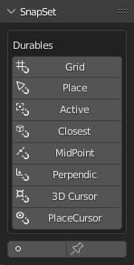
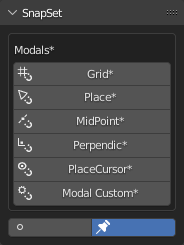
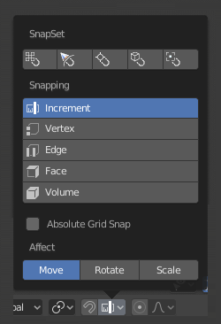
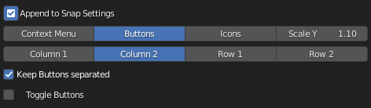
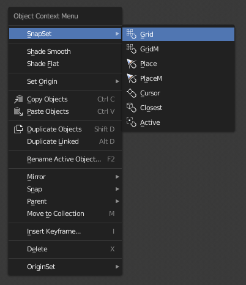
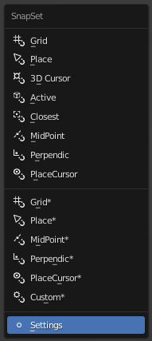
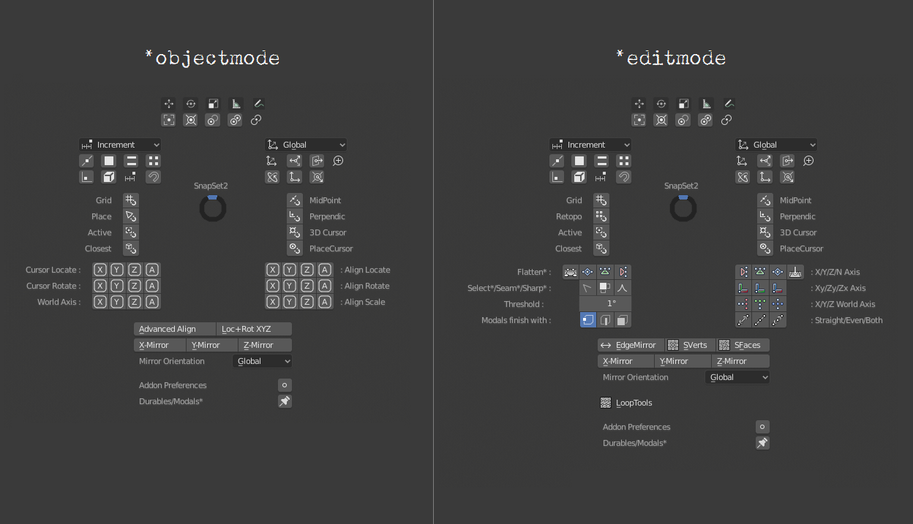

# SnapSet - Blender Addon

> Batch presets for snapping task

- as durable buttons or as one time modal buttons 
- all buttons are full customizable
- different layouts for context menus and pie menu with custom shortcut key creation
- appending to different locations: editor header, special menu, snapping setting panel, etc.
- with auxiliary addons for the pie menu: align objects (objectmode), looptools and align mesh (editmode)

Release Download https://github.com/mkbreuer/view3d_snapset/releases

##

### Durable Tools 
> After execute the snap settings toggle to the needed durable preferences.                       
                      
- Grid        > snap pivot with absolute grid alignment               
- Place       > objectmode: snap object to surface of other objects
- Retopo      > editmode: snap selected onto target surface    
- Cursor      > set 3d cursor to active or selected  
- Closest     > snap closest point onto target  
- Active      > snap active pivot onto target  
- MidPoint    > snap selected onto target 
- Perpendic   > snap selected onto target 
- PlaceCursor > place 3D cursor onto a target surface 

### (*) Modal Tools  
> After execute the snap settings toggle to the needed modal preferences.  
> It finish the modal directly after an click and the settings switch back to the previous durable one.                          

- Grid*           > snap pivot with absolute grid alignment till release             
- Place*          > object mode: snap object to surface of other objects till release  
- Retopo*         > edit mode: snap selected onto target surface till release 
- MidPoint*       > snap selected onto target till release 
- Perpendic*      > snap selected onto target till release 
- PlaceCursor*    > snap 3d cursor onto target surface till release 
- Custom*         > customizable extra button

##

### Panel layout

### Append to header snap settings

                                       
### Append to context menu, key [W]
    

### Custom context menu, key [customizable]
  

### Custom pie menu, key [customizable]
 

### Auxiliary addons for the pie menu
  

### Align Mesh Addon
- comes not with blender by default and must be installed separatly!
- release download: https://github.com/mkbreuer/view3d_alignmesh/releases

---

### Support core Blender development - https://fund.blender.org